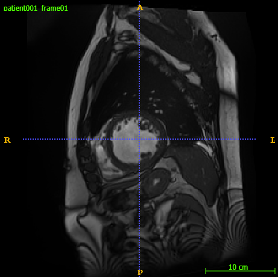
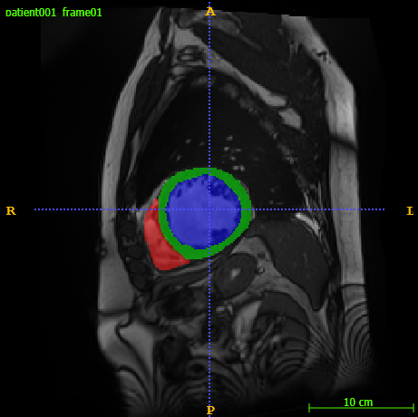
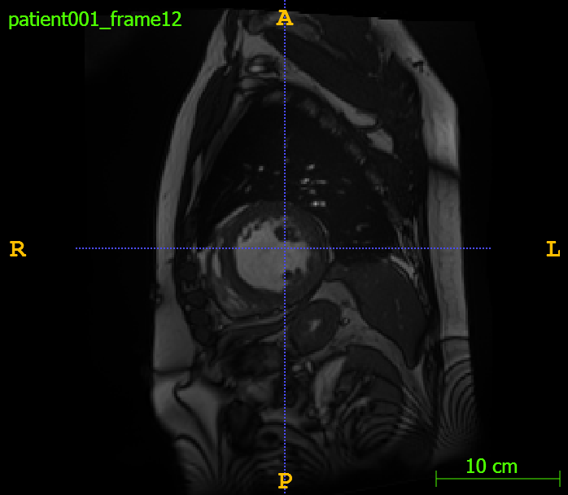
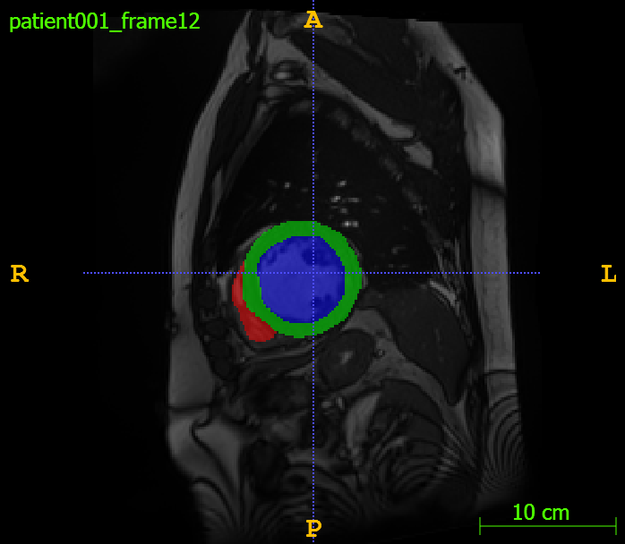

# 🔍 Demo: Cardiac MRI Segmentation & Structured Pruning Framework

This demo showcases the key components of my master thesis project:  
a **UNet-based cardiac MRI segmentation pipeline**, extended with **structured L1 filter pruning**, rewinding, and rebuildable architectures.

The goal of this demo is to walk through the system’s structure,  
show meaningful code snippets, and present results —  
**without running heavy training during the interview.**

---

# 1️⃣ Project Overview

This project performs automatic segmentation of cardiac structures (LV, RV, myocardium) from short-axis MRI slices.  
It uses:

- A 2D UNet trained on ED/ES volumes from the ACDC dataset  
- L1-based structured pruning to remove entire convolutional filters  
- A rebuildable pruned UNet architecture  
- Config-driven experiment management  
- Evaluation before and after pruning  

---

# 2️⃣ Dataset Overview

The ACDC dataset provides two 3D MRI volumes per patient:

- **ED (End-Diastolic)** — heart maximally filled  
- **ES (End-Systolic)** — heart fully contracted  

Each volume contains ~10 short-axis slices.

**Dataset size:**

- Training: 100 patients × 2 volumes × ~10 slices ≈ **2000 2D slices**  
- Test: 50 patients × 2 volumes × ~10 slices ≈ **1000 2D slices**

### 📁 Example Patient Folder
```
patient001/
    patient001_4d.nii.gz
    patient001_frame01.nii.gz       # ED volume
    patient001_frame01_gt.nii.gz    # ED mask
    patient001_frame12.nii.gz       # ES volume
    patient001_frame12_gt.nii.gz    # ES mask
```

### Example (ED + ES)
| ED Image | ED Overlay |
|----------|------------|
|  |  |

| ES Image | ES Overlay |
|----------|------------|
|  |  |

---

# 3️⃣ Pipeline Overview

```
3D Volume (.nii.gz)
        ↓
Slice Extraction (2D)
        ↓
Normalization + Resize
        ↓
Augmentation (train only)
        ↓
UNet Forward Pass
        ↓
Metrics (Dice, IoU, Acc)
        ↓
Structured L1 Pruning
        ↓
Rebuild Pruned UNet
        ↓
Retrain + Evaluate
```

---

# 4️⃣ Key Code Snippets

## ✂️ Block-wise L1 Filter Pruning
```python
def get_pruning_masks_blockwise(model, norms, block_ratios):
    masks = {}
    for name, weight in model.named_parameters():
        if "weight" in name and weight.ndim == 4:
            block_name = name.split(".")[0] + "." + name.split(".")[1]
            ratio = block_ratios.get(block_name, 0.0)
            num_filters = weight.shape[0]
            k = int(num_filters * ratio)

            l1 = norms[name]
            keep = torch.topk(l1, num_filters - k).indices
            mask = torch.zeros_like(l1, dtype=bool)
            mask[keep] = True
            masks[name] = mask
    return masks
```

## 🧱 UNet Architecture Snippet
```python
class DoubleConv(nn.Module):
    def __init__(self, in_c, out_c):
        super().__init__()
        self.net = nn.Sequential(
            nn.Conv2d(in_c, out_c, 3, padding=1),
            nn.ReLU(),
            nn.Conv2d(out_c, out_c, 3, padding=1),
            nn.ReLU(),
        )

    def forward(self, x):
        return self.net(x)
```

## ⚙️ Centralized Configuration
```yaml
training:
  batch_size: 8
  learning_rate: 1e-3
  num_epochs: 40

pruning:
  block_ratios:
    encoders.1: 0.1
    decoders.3: 0.3
  reinitialize_weights: rewind
```

---

# 5️⃣ Results & Artifacts

## 📊 L1 Norm Distribution (before pruning)


## ✂️ Pruning Mask Example
```python
{
  "encoders.1": [True, False, True, True, ...],
  "decoders.3": [True, True, False, ...]
}
```

## 📉 Parameter Reduction
| Model | Params | Δ | Dice |
|-------|--------|-----|-------|
| Baseline UNet | 8.2M | – | 0.91 |
| Pruned UNet | 3.6M | −56% | 0.90 |

## 🎨 Example Segmentation Output
| Input Slice | Prediction |
|-------------|------------|
|  |  |

---

# 6️⃣ Engineering Takeaways

- Config-driven design enables reproducibility  
- Modular pruning system supports arbitrary architectures  
- Rewinding stabilizes pruned training  
- Rebuilding ensures the pruned model is *actually smaller*  
- Pipeline scales from quick tests → full sweeps  
- Clean separation of:
  - data  
  - model  
  - training  
  - pruning  
  - evaluation  
  - experiment runner  

---

# 7️⃣ Appendix (Optional)

- full pruning masks  
- full logs  
- model summary  
- L1 per-layer tables  

