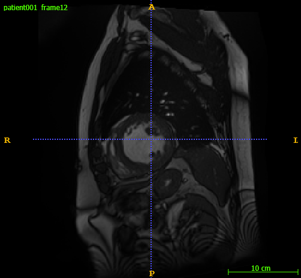
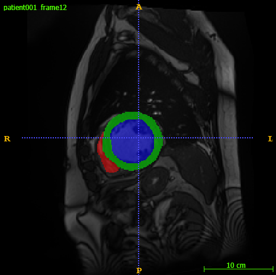

# 🔍 Demo: Cardiac MRI Segmentation & Structured Pruning Framework

This demo showcases the key components of my master thesis project:  
a **UNet-based cardiac MRI segmentation pipeline**, extended with **structured L1 filter pruning**, rewinding, and rebuildable architectures.

The goal of this demo is to walk through the system’s structure,  
show meaningful code snippets, and present some preliminary results I obtained. 

---

# 1️⃣ Project Overview

Deep learning models for medical imaging have grown increasingly large, leading to higher memory usage, longer inference times, and difficulty deploying models on resource-limited systems.  
This motivates the use of **model pruning**, a family of techniques aimed at reducing the number of parameters while preserving model accuracy.

Pruning comes in two major forms:

- **Unstructured pruning** removes individual weights based on some importance metric (e.g., magnitude).  
  This can drastically reduce the number of non-zero parameters, but the resulting sparse weight tensors do *not* map efficiently to standard hardware.  
  As a result, unstructured pruning typically **does not reduce model size or inference time** in real deployments.

- **Structured pruning**, on the other hand, removes entire convolutional filters or channels.  
  Because this changes the actual layer dimensions, the resulting model is **smaller, faster, and cheaper to evaluate** on real hardware.  
  However, structured pruning is far more complex: pruning a filter in one layer requires adjusting all downstream layers so that channel dimensions remain consistent.

This project implements a complete framework for **structured L1-norm filter pruning** applied to a 2D U-Net trained on ED/ES cardiac MRI slices from the ACDC dataset.  
The system includes:

- A 2D U-Net for segmenting LV, RV, and myocardium  
- L1-norm based ranking of convolutional filters  
- Block-wise pruning ratios controlling how many filters to remove per block  
- A **rebuildable pruned U-Net** that automatically adjusts channel sizes  
- Config-driven experiment management for reproducible training and pruning  
- Evaluation both before and after pruning to quantify accuracy impact

The goal is to reduce model parameters and computation while maintaining high segmentation performance, demonstrating the feasibility of deploying efficient medical imaging models.

---

# 2️⃣ Repository Overview

To support a clean, modular, and fully reproducible experimentation setup, the project is organized into a structured repository.  
Each component of the pipeline—model definition, preprocessing, training, pruning, evaluation, and logging—is cleanly separated.  
This allows experiments to be controlled from a single configuration file, while keeping the codebase maintainable and scalable.

The repository is organized as follows:

```
src/
    models/
        unet.py                # U-Net architecture

    pipeline/
        baseline.py            # Baseline training pipeline
        pruned.py              # Pruning + retraining pipeline
        run_full_exp.py        # Automates full experiment runs

    pruning/
        l1_pruning.py          # L1 filter ranking + pruning mask generation
        model_inspect.py       # L1 statistics, mask inspection, feature distributions
        rebuild.py             # Rebuilds a reduced U-Net based on pruning masks
        l1_analysis/           # Visualizations (histograms, layer summaries)

    training/
        data_loader.py         # Preprocessing, slice extraction, PyTorch Dataset + Dataloader
        train.py               # Model training loop
        eval.py                # Evaluation loop (Dice, IoU, accuracy)
        metrics.py             # Metric implementations + FLOPs / inference time utilities
        loss.py                # Loss functions (Dice, CE, combined losses)

    utils/
        config.py              # YAML configuration loader + override mechanism
        paths.py               # Experiment folder and results management
        wandb_utils.py         # Weights & Biases logging helpers

    config.yaml                # Central configuration file for model, training, pruning
```

### 🔍 Design Principles Behind the Structure

- **Modularity:**  
  Each subsystem (training/evaluation, pruning, rebuilding) lives in its own directory, making the pipeline easy to understand and extend.

- **Reproducibility:**  
  All hyperparameters, model settings, and pruning ratios are controlled through `config.yaml`, ensuring experiments can be repeated exactly.

- **Pipeline Automation:**  
  The `pipeline/` directory contains scripts that orchestrate end-to-end runs:
    - Baseline training + evaluation  
    - Structured pruning + evaluation + retraining + evaluation  
    - Full experiment sweep (with option to run certain loops to test different hyperparameter setups)

---

# 2️⃣ Model Overview

The segmentation model used in this project is a **2D U-Net**, a widely adopted convolutional neural network architecture designed specifically for biomedical image segmentation.  
U-Net follows an encoder–decoder structure:

- The **encoder** (downsampling path) extracts increasingly abstract feature representations through repeated convolution and max-pooling operations.
- The **decoder** (upsampling path) gradually reconstructs spatial resolution using transposed convolutions.
- **Skip connections** between encoder and decoder stages allow fine-grained spatial information to flow directly into the corresponding upsampling layers, improving segmentation accuracy.

U-Net is particularly effective for tasks where precise localization is required — such as delineating cardiac structures (LV, RV, myocardium) in MRI slices — because it combines high-level semantic information with detailed spatial context.  
Its strong performance on small and medium-sized biomedical datasets makes it a standard baseline for medical image segmentation tasks like the one addressed in this project. Below an image of the U-Net structure is depicted. 

<p align="center">
  
</p>

---

# 2️⃣ Dataset Overview

The ACDC dataset provides two 3D MRI volumes per patient:

- **ED (End-Diastolic)** — heart maximally filled  
- **ES (End-Systolic)** — heart fully contracted  

Each volume contains ~10 short-axis slices.

**Dataset size:**

- Training: 100 patients × 2 volumes × ~10 slices ≈ **2000 2D slices**  
- Test: 50 patients × 2 volumes × ~10 slices ≈ **1000 2D slices**

### 📁 Example Patient Folder
```
patient001/
    patient001_4d.nii.gz
    patient001_frame01.nii.gz       # ED volume
    patient001_frame01_gt.nii.gz    # ED mask
    patient001_frame12.nii.gz       # ES volume
    patient001_frame12_gt.nii.gz    # ES mask
```

### Example (ED + ES)
| ED Image | ED Overlay |
|----------|------------|
|  |  |

| ES Image | ES Overlay |
|----------|------------|
|  |  |

---

# 3️⃣ Pipeline Overview

The framework consists of **three main stages**:

---

## 1. Preprocessing

```
3D MRI (.nii.gz)
   ↓  Slice extraction (2D)
   ↓  Normalization & resizing
   ↓  Augmentation (train only)
```

This produces clean, standardized 2D slices for the 2D UNet.

---

## 2. Baseline Training & Evaluation

```
2D slices
   ↓  Training & save model
   ↓  Evaluation on the test set (Dice, IoU, Acc)
```

This yields the reference performance of the full UNet.

---

## 3. Structured Pruning & Retraining

```
L1 norms
   ↓  Compute L1 norms per channel and create pruning mask
   ↓  Prune channels according to the block ratios
   ↓  Rebuild smaller UNet
   ↓  Init weights (none/random/rewind)
   ↓  Evaluate
   ↓  Retrain (optional)
   ↓  Final evaluation
```

This stage compresses the model and measures the performance impact.

---

# 4️⃣ Key Code Snippets

## ⚙️ Centralized Configuration
```yaml
experiment:
  experiment_name: exp41
  model_name: UNet_ACDC
  seed: 42
  device: cuda
train:
  phase: training
  val_ratio: 0.2
  batch_size: 32
  num_slices_per_volume: null
  model:
    in_channels: 1
    out_channels: 4
    features:
    - 64
    - 128
    - 256
    - 512
    - 512
  parameters:
    learning_rate: 0.0009
    num_epochs: 100
    save_interval: 25
    loss_function: ce_dice
  paths:
    train_dir: /media/ttoxopeus/datasets/nnUNet_raw/Dataset200_ACDC/imagesTr
    label_dir: /media/ttoxopeus/datasets/nnUNet_raw/Dataset200_ACDC/labelsTr
    save_root: results
evaluation:
  phase: baseline_evaluation
  batch_size: 1
  num_slices_per_volume: null
  num_visuals: 3
  paths:
    eval_dir: /media/ttoxopeus/datasets/nnUNet_raw/Dataset200_ACDC/imagesTs
    label_dir: /media/ttoxopeus/datasets/nnUNet_raw/Dataset200_ACDC/labelsTs
    save_root: results
pruning:
  method: l1_norm
  reinitialize_weights: null # null, "random" or "rewind"
  ckpt_path:
    subfolder: baseline
    ckpt_name: final_model.pth
  save_path:
    subfolder: pruned
    filename: pruned_model.pth
  ratios:
    default: 0.25
    block_ratios:
      encoders.0: 0.0
      encoders.1: 0.0
      encoders.2: 0.0
      encoders.3: 0.0
      encoders.4: 0.01
      bottleneck: 0.0
      decoders.1: 0.0
      decoders.3: 0.0
      decoders.5: 0.0
      decoders.7: 0.0
      decoders.9: 0.0
```

---

# Rebuild pruned model

```python
def rebuild_pruned_unet(model, masks, save_path=None):
    """Main orchestrator."""

    print("Rebuilding pruned UNet architecture...")

    enc_features, bottleneck_out, dec_features = get_pruned_feature_sizes(model, masks)

    pruned_model = build_pruned_unet(model, enc_features, dec_features=dec_features, bottleneck_out=bottleneck_out)
    pruned_model = copy_pruned_weights(model, pruned_model, masks)

    plot_unet_schematic(enc_features, dec_features, bottleneck_out, 
                        in_ch=1, out_ch=4, figsize=(10, 6), title="U-Net Structure")


    if save_path:
        os.makedirs(os.path.dirname(save_path), exist_ok=True)
        torch.save(pruned_model.state_dict(), save_path)
        print(f"💾 Saved pruned model to {save_path}")

        meta = {
            "enc_features": enc_features,
            "dec_features": dec_features,
            "bottleneck_out": bottleneck_out,
        }

        meta_path = save_path.with_name(save_path.stem + "_meta.json")
        with open(meta_path, "w") as f:
            json.dump(meta, f, indent=4)
        #print(f"🧾 Saved metadata to {meta_path}")

    print("UNet successfully rebuilt.")
    return pruned_model
```

# 5️⃣ Results & Artifacts

## 📊 L1 Norm Distribution (before pruning)


## ✂️ Pruning Mask Example
```python
{
  "encoders.1": [True, False, True, True, ...],
  "decoders.3": [True, True, False, ...]
}
```

## 📉 Parameter Reduction
| Model | Params | Δ | Dice |
|-------|--------|-----|-------|
| Baseline UNet | 8.2M | – | 0.91 |
| Pruned UNet | 3.6M | −56% | 0.90 |

## 🎨 Example Segmentation Output
| Input Slice | Prediction |
|-------------|------------|
|  |  |

---

# 6️⃣ Engineering Takeaways

- Config-driven design enables reproducibility  
- Modular pruning system supports arbitrary architectures  
- Rewinding stabilizes pruned training  
- Rebuilding ensures the pruned model is *actually smaller*  
- Pipeline scales from quick tests → full sweeps  
- Clean separation of:
  - data  
  - model  
  - training  
  - pruning  
  - evaluation  
  - experiment runner  

---

# 7️⃣ Appendix (Optional)

- full pruning masks  
- full logs  
- model summary  
- L1 per-layer tables  

