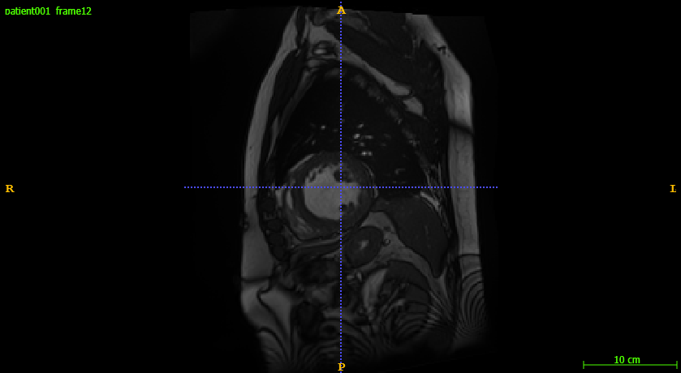
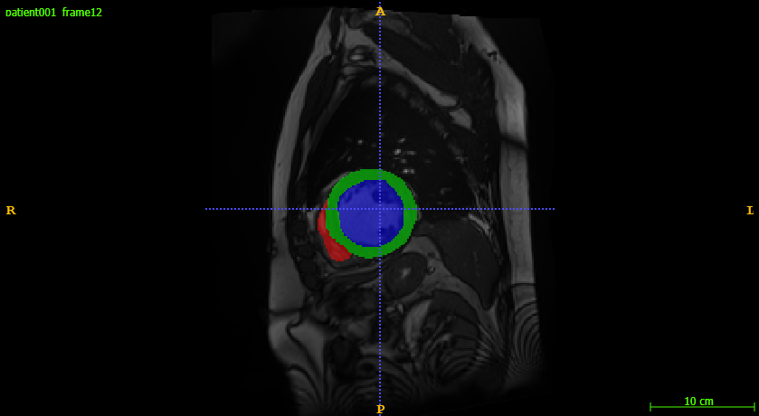

# 🧩 basic_UNet

A lightweight and modular **2D U-Net framework** for medical image segmentation, with a full pipeline for **training, evaluation, structured pruning, rewinding, model inspection, and experiment automation**. Developed and tested on the **ACDC cardiac MRI dataset**, but compatible with any 2D segmentation dataset.

---

# 📌 Table of Contents
- [✨ Features](#-features)
- [📁 Project Structure](#-project-structure)
- [📦 Installation](#-installation)
- [📚 Dataset](#-dataset)
- [⚙️ Configuration System](#️-configuration-system)
- [🚀 Baseline Training](#-baseline-training)
- [🎯 Evaluation](#-evaluation)
- [✂️ Structured Pruning Pipeline](#️-structured-pruning-pipeline)
  - [L1 block-wise pruning](#l1-block-wise-pruning)
  - [Rewinding options](#rewinding-options)
  - [Rebuilding a pruned UNet](#rebuilding-a-pruned-unet)
- [🧪 Model Inspection & L1 Analysis](#-model-inspection--l1-analysis)
- [📊 Experiment Logging](#-experiment-logging)
- [🧵 Full Experiment Runner](#-full-experiment-runner)
- [📈 Example Results](#-example-results)
- [🛣️ Roadmap](#️-roadmap)
- [🧠 Author](#-author)

---

# ✨ Features

### 🧠 UNet Architecture
- Clean, modular UNet defined in `src/models/unet.py`
- Easily modifiable architecture (depth, channels, features)

### 🚀 Training & Evaluation
- Full baseline training pipeline (`src/pipeline/baseline.py`)
- Dice, IoU, and loss logging
- Learning rate scheduling
- Automatic checkpointing
- Evaluation pipeline (`src/training/eval.py`)

### ✂️ Structured L1 Pruning (Block-wise)
- L1 filter norm computation
- Block-wise pruning ratios (e.g., `decoders.1: 0.3`)
- Pruning masks stored as JSON
- Rebuild a smaller pruned UNet automatically

### 🔄 Weight Reinitialization Modes
- `none` → keep weights post-pruning
- `random` → reinitialize pruned model from scratch
- `rewind` → restore weights from early checkpoint

### 📉 Model Inspection
- L1 histograms
- Layer statistics
- Channel shapes
- Visualization tools

### ⚙️ Dynamic Configuration System
- YAML config with structured training + pruning configuration
- Runtime overrides (epochs, LR, pruning mode, ratios)
- Automatic path generation via `utils/paths.py`

### 🧪 Experiment Automation
- `run_full_exp.py` runs a full sweep: `baseline → prune → retrain/evaluate → repeat for each mode`

### 📈 Logging
- Local logging (JSON, PNG, checkpoints)
- W&B integration available

---

# 📁 Project Structure

    src/
        models/
            unet.py                # U-Net architecture

        pipeline/
            baseline.py            # Baseline training pipeline
            pruned.py              # Pruning + retraining pipeline
            run_full_exp.py        # Automates full experiment runs

        pruning/
            l1_pruning.py          # Pruning pipeline (combines all pruning scripts)
            model_inspect.py       # L1 norm & mask functions + inspect shapes, features, distributions
            rebuild.py             # Rebuild pruned UNet functions
            l1_analysis/           # Histograms of l1 norm distributions between layers

        training/
            data_loader.py         # ACDC dataset handling (preprocessing + Dataset + Dataloader)
            train.py               # Training pipeline
            eval.py                # Evaluation pipeline
            metrics.py             # Dice, IoU, flops, inference time
            loss.py                # Loss functions and combinations

        utils/
            config.py              # YAML loader + overrides
            paths.py               # Experiment folder management
            wandb_utils.py         # W&B logging

        config.yaml                # Main configuration file

---

# 📦 Installation

    git clone https://github.com/TijmenToxopeus/basic_UNet.git
    cd basic_UNet
    pip install -r requirements.txt

Requires:
- Python ≥ 3.10  
- PyTorch ≥ 2.0  

---

# 📚 Dataset

This framework uses **2D slices extracted from 3D NIfTI volumes (`.nii.gz`)**, such as those provided by the **ACDC cardiac MRI dataset**.  
Each patient folder contains end-diastolic (ED) and end-systolic (ES) frames together with corresponding ground-truth masks.

---

## 📂 Example Patient Folder (ACDC)
    patient001/
        patient001_4d.nii.gz # Full 4D cine MRI: (H, W, slices, time)
        patient001_frame01.nii.gz # ED frame (raw image)
        patient001_frame01_gt.nii.gz # ED segmentation mask
        patient001_frame12.nii.gz # ES frame (raw image)
        patient001_frame12_gt.nii.gz # ES segmentation mask
        MANDATORY_CITATION # Required citation file
        Info # Metadata
  
---

## 📘 Meaning of Each File

| File | Description |
|------|-------------|
| `patient001_4d.nii.gz` | Complete 4D cine stack (not always used directly) |
| `patient001_frame01.nii.gz` | End-diastolic (ED) volume |
| `patient001_frame01_gt.nii.gz` | ED ground-truth mask |
| `patient001_frame12.nii.gz` | End-systolic (ES) volume |
| `patient001_frame12_gt.nii.gz` | ES ground-truth mask |

The masks contain **integer class labels** (not RGB colors):
- 0 → background  
- 1 → RV  
- 2 → myocardium  
- 3 → LV  

---
## 🖼️ Example (ED and ES Slices)

### End-Diastolic (ED)
<table>
<tr>
<td><strong>Image</strong></td>
<td><strong>Overlay</strong></td>
</tr>
<tr>
<td></td>
<td></td>
</tr>
</table>

### End-Systolic (ES)
<table>
<tr>
<td><strong>Image</strong></td>
<td><strong>Overlay</strong></td>
</tr>
<tr>
<td></td>
<td></td>
</tr>
</table>

## 🔧 Preprocessing Into 2D Slices

The training pipeline expects **2D images and masks**, typically exported into:
    data/
        images/
        masks/

# ⚙️ Configuration System

All experiment settings are defined in:

    config.yaml

Example:

    model:
      in_channels: 1
      out_channels: 4

    training:
      batch_size: 8
      learning_rate: 1e-3
      num_epochs: 40

    pruning:
      block_ratios:
        encoders.1: 0.1
        decoders.3: 0.3
      reinitialize_weights: rewind

Pipelines may override LR, epochs, pruning ratio, or rewinding mode during sweeps.

---

# 🚀 Baseline Training

Train the full UNet:

    python -m src.pipeline.baseline

Outputs include:
- model checkpoints  
- `metrics.json`  
- `training_curves.png`  
- prediction samples  

---

# 🎯 Evaluation

Evaluate a trained model:

    python -m src.training.eval

Metrics include:
- Dice score  
- IoU  
- Pixel accuracy  
- Precision/recall  

---

# ✂️ Structured Pruning Pipeline

Prune the UNet and evaluate:

    python -m src.pipeline.pruned --mode rewind

Modes:
- `none`  
- `random`  
- `rewind`  

---

## L1 Block-wise Pruning

Block ratios define how many filters to prune in each block.

Example:

    block_ratios:
      encoders.0: 0.0
      encoders.1: 0.1
      decoders.3: 0.4
      decoders.5: 0.2

Process:
1. Compute L1 norm  
2. Rank filters  
3. Drop lowest-norm filters  
4. Save pruning mask  
5. Apply pruning to UNet  

---

## Rewinding Options

| Mode   | Description                            |
|--------|----------------------------------------|
| none   | Keep pruned weights                    |
| random | Reinitialize the pruned model          |
| rewind | Restore weights from an earlier checkpoint |

Example:

    python -m src.pipeline.pruned --reinitialize_weights rewind

---

## Rebuilding a Pruned UNet

    python -m src.pruning.rebuild

This script:
- Reads pruning masks  
- Computes new channel sizes  
- Builds a reduced UNet  
- Loads surviving weights  

---

# 🧪 Model Inspection & L1 Analysis

Inspect L1 statistics:

    python -m src.pruning.model_inspect

Generates:
- Histograms  
- Layer statistics  
- CSV summaries  

Located in:

    results/analysis/

Notebooks:
- `l1_distributions.ipynb`  
- `pruning_notebook.ipynb`  

---

# 📊 Experiment Logging

### Local Logging (default)

    results/<experiment>/<timestamp>/

Includes:
- `metrics.json`  
- training curves  
- sample predictions  
- model `.pt` files  

### Weights & Biases (optional)

Enable via:

    logging:
      use_wandb: true
      project: "basic_unet_pruning"

---

# 🧵 Full Experiment Runner

Run the entire pipeline:

    python -m src.pipeline.run_full_exp

This performs:

    1. Train baseline
    2. Prune (mode=none)
    3. Prune (mode=random)
    4. Prune (mode=rewind)
    5. Evaluate all

Each experiment overrides LR, epochs, and pruning settings automatically.

---

# 📈 Example Results

| Model         | Params | FLOPs     | Dice | Notes            |
|---------------|--------|----------:|------|------------------|
| Baseline UNet | 1.9M   | 55 GFLOPs | 0.88 | —                |
| Pruned 30%    | 1.4M   | 38 GFLOPs | 0.87 | Smaller model    |
| Pruned 50%    | 1.0M   | 28 GFLOPs | 0.85 | More aggressive  |

Training/validation curves saved as:

    training_curves.png

---

# 🛣️ Roadmap

- [ ] Learning rate finder  
- [ ] FLOPs/latency benchmarking  
- [ ] Add Attention UNet / UNet++  
- [ ] 3D support  
- [ ] Combined pruning + quantization  
- [ ] Export models to ONNX/TensorRT  

---

# 🧠 Author

**Tijmen Toxopeus**  
Master’s student in Applied Physics (TU Delft)  
Focus: medical image segmentation, structured pruning, efficient deep learning.
